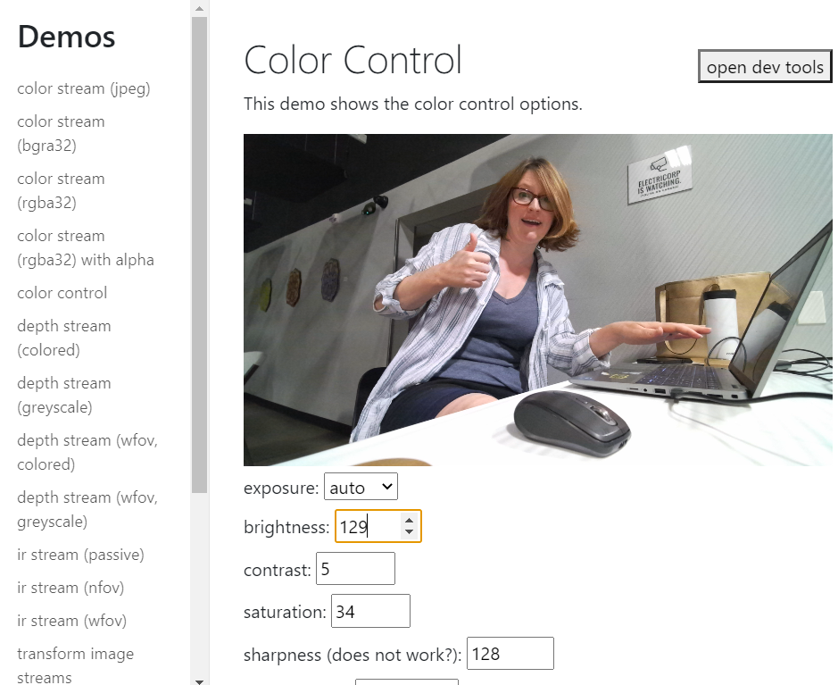

# Electric Playhouse Azure Kinect Library for Node / Electron

This library enables you to use the Azure Kinect (without body tracking!) in your nodejs or electron apps.  It was specially designed to be used for Electric Playhouse Zap.

It is a fork of the existing library [Azure Kinect](https://github.com/wouterverweirder/kinect-azure) by Wouter Verweirder.



Features:

- get rgb camera feed
- get depth feed
- get ir feed
- transform between color and depth feed
- point cloud (greyscale and colored)
- body index / user masking
- get temperature / accelerometer / gyroscope data (IMU data)

## Installation

Make sure you have the [Azure Kinect](https://learn.microsoft.com/en-us/azure/kinect-dk/sensor-sdk-download) SDK installed.

The current version of this library links to:
- Azure Kinect Sensor SDK v1.4.1

On Windows, the sdk relies on quite a few dll & onnx files, which you can find in the `Azure Kinect SDK\tools` directory. Add that folder (eg C:\Program Files\Azure Kinect SDK v1.4.1\tools) to your PATH before trying to run!


### Potential issues

#### Error: The specified module could not be found

This module relies on some dll & onnx files from the kinect azure installation. If those files can't be loaded, loading the module will fail as well. You can can find those in the `Azure Kinect SDK\tools` directory. Add that folder (eg C:\Program Files\Azure Kinect SDK v1.4.1\tools) to your PATH.

#### MSBuild.exe ENOENT

You might run into the error below when trying to install this module:

> Error: spawn C:\Program Files (x86)\Microsoft Visual Studio\2019\BuildTools\MSBuild\15.0\Bin\MSBuild.exe ENOENT

To fix this, make sure to install the latest version of node-gyp globally:

```
$ npm install -g node-gyp
```

## Examples

There are nodejs and electron examples in the examples/ folder of this repo. To run them, execute npm install and npm start:

```
$ cd examples/electron
$ npm install
$ npm start
```

The electron examples have the javascript code inside the html files. You can find these html files in [examples/electron/renderer/demos](examples/electron/renderer/demos).